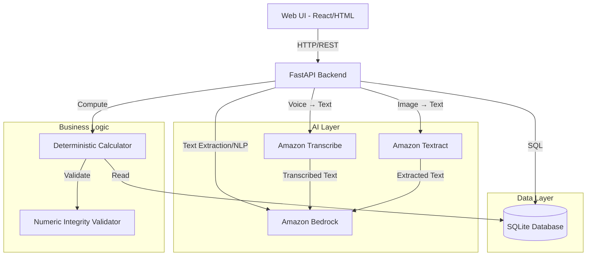

# Design Document: VyapaarMitra

## Executive Summary

VyapaarMitra is a hybrid AI-deterministic system that combines Amazon Bedrock's language understanding with deterministic algorithms for reliable inventory management. The architecture ensures that while AI enhances user experience and data capture, all critical business decisions are based on verifiable, deterministic calculations.

**Key Design Principles**:
1. **Separation of Concerns**: AI handles unstructured inputs, deterministic code handles business logic
2. **Progressive Capture**: Three modes (Pulse/WhatsApp/POS) adapt to store's digital maturity
3. **Responsible AI**: Guardrails prevent hallucinated numbers, all responses cite sources
4. **Store Type Adaptation**: Configurable parameters for kirana/mini-mart/supermarket
5. **Privacy & Consent**: Explicit user consent for data handling, transparent data usage
6. **Numeric Integrity**: Validation layer ensures all numeric outputs are deterministically computed
7. **Demo-Ready**: Live Bedrock integration, pre-seeded sample data, 2-3 minute demo flow

**Technology Stack**:
- Backend: FastAPI (Python 3.11+)
- Database: SQLite → PostgreSQL migration path
- AI: Amazon Bedrock (Claude 3 Sonnet/Haiku)
- Multimodal: Amazon Transcribe (voice), Amazon Textract (images)
- Frontend: React/HTML responsive web app
- Deployment: AWS (EC2/ECS/Lambda)

**Market Context**: India has approximately 12 million grocery retail outlets [CITE: McKinsey 2022 grocery retail India] and many business reports cite ~13 million kirana stores [CITE: Business Standard/Hindustan Times 2024 kirana store count]. This design addresses the inventory management needs of small-format retail stores that lack traditional POS infrastructure.

**Technical Feasibility**: All components use production-ready technologies available in AWS Mumbai region. MVP can be built in 4 weeks with 2 developers. Demo requires <30 minutes setup time.

## Overview

VyapaarMitra is a hybrid AI-deterministic system that combines Amazon Bedrock's language understanding capabilities with deterministic algorithms for reliable inventory management across small-format retail stores (kirana shops, mini-marts, and small supermarkets). The architecture follows a clear separation of concerns:

- **AI Layer (Bedrock)**: Handles unstructured data extraction (text, images, voice), product name normalization, and natural language interactions
- **Deterministic Layer (Python)**: Computes all business-critical numbers (reorder quantities, stockout risks, confidence scores)
- **Data Layer (SQLite)**: Persists inventory state, purchase history, user preferences, and store configuration
- **API Layer (FastAPI)**: Exposes RESTful endpoints for the frontend
- **UI Layer (Web)**: Provides a responsive interface for mobile and desktop access

This separation ensures that while AI enhances user experience and data capture, all critical business decisions are based on verifiable, deterministic calculations. The system adapts to different store types through configurable parameters while maintaining consistent core logic.

## Architecture

### System Components



### Multimodal Processing Pipeline

The system handles three types of inputs through a staged pipeline:

1. **Text Input** (WhatsApp messages):
   - Direct input → Bedrock for extraction

2. **Voice Input** (WhatsApp voice notes):
   - Audio file → Amazon Transcribe → Transcribed text → Bedrock for structuring

3. **Image Input** (WhatsApp screenshots, receipts):
   - Image file → Amazon Textract (or vision-capable Bedrock model) → Extracted text → Bedrock for structuring

This staged approach ensures that Bedrock receives text input for all modalities, allowing consistent extraction logic while leveraging specialized AWS services for modality-specific preprocessing.

### Technology Stack

- **Backend**: FastAPI (Python 3.11+)
- **Database**: SQLite with SQLAlchemy ORM
- **AI Service**: Amazon Bedrock (Claude 3 Sonnet for extraction, Claude 3 Haiku for chat)
- **Voice Processing**: Amazon Transcribe (Hindi and English support)
- **Image Processing**: Amazon Textract (OCR) or Bedrock vision-capable models
- **Frontend**: Simple HTML/CSS/JavaScript (or React for enhanced UX)
- **Deployment**: Local development, containerizable for AWS deployment

### Data Flow

1. **Input Capture**: User provides data via Pulse Mode (manual), WhatsApp Mode (upload), or POS Mode (CSV)
2. **Multimodal Preprocessing**: Voice → Transcribe, Images → Textract, Text → direct
3. **AI Extraction**: Bedrock extracts structured data from text inputs
4. **Normalization**: Product names are normalized to canonical identifiers
5. **Numeric Validation**: All numeric outputs validated by integrity checker
6. **Persistence**: Structured data is saved to SQLite
7. **Computation**: Deterministic algorithms calculate reorder quantities and risks
8. **Presentation**: Results are displayed via web UI with explanations
9. **Interaction**: User can query via chat interface for insights

## Components and Interfaces

### 1. Data Models

#### Store
```python
class Store:
    id: str  # UUID
    name: str
    store_type: str  # "kirana", "mini_mart", "small_supermarket"
    default_tracked_skus: int  # 50, 80, or 200 based on type
    target_cover_days: int  # 5-7, 7-10, or 10-14 based on type
    lead_time_days: int  # User-configurable, defaults: 2-3, 3-5, or 5-7
    preferred_language: str  # "hi" or "en"
    created_at: datetime
    updated_at: datetime
```

#### Product
```python
class Product:
    id: str  # UUID
    store_id: str  # Foreign key to Store
    canonical_name: str  # e.g., "Tata Salt 1kg"
    category: str  # e.g., "Staples"
    unit: str  # e.g., "kg", "piece"
    variants: List[str]  # Alternative names
    created_at: datetime
    updated_at: datetime
```

#### StockLevel
```python
class StockLevel:
    id: str  # UUID
    product_id: str  # Foreign key to Product
    quantity_bucket: int  # 0, 1, 2, 3, or 4 (representing 4+)
    actual_quantity: Optional[int]  # If known precisely
    recorded_at: datetime
    mode: str  # "pulse", "whatsapp", "pos"
```

#### PurchaseEvent
```python
class PurchaseEvent:
    id: str  # UUID
    product_id: str  # Foreign key to Product
    quantity: float
    unit_price: Optional[float]
    total_price: Optional[float]
    supplier: Optional[str]
    purchased_at: datetime
    source: str  # "whatsapp_text", "whatsapp_image", "whatsapp_voice", "csv"
    confidence_score: float  # 0.0 to 1.0
    verified: bool  # User confirmed
    raw_data: str  # Original input for audit
```

#### ReorderRecommendation
```python
class ReorderRecommendation:
    id: str  # UUID
    store_id: str  # Foreign key to Store (needed for validation)
    product_id: str  # Foreign key to Product
    recommended_quantity: float
    urgency: str  # "low", "medium", "high"
    confidence_score: float
    stockout_risk: float  # 0.0 to 1.0
    current_stock: int
    avg_daily_consumption: float
    days_until_stockout: Optional[float]
    generated_at: datetime
    user_adjusted_quantity: Optional[float]
```

### 2. Bedrock Integration Module

#### Extraction Service

**Purpose**: Extract structured data from text inputs using Bedrock. For non-text inputs, preprocessing services convert them to text first.

**Interface**:
```python
class BedrockExtractionService:
    def extract_from_text(self, text: str) -> ExtractionResult
    def extract_from_image(self, image_bytes: bytes) -> ExtractionResult
    def extract_from_voice(self, audio_bytes: bytes) -> ExtractionResult
    def normalize_product_name(self, raw_name: str, context: List[str]) -> NormalizationResult

class MultimodalPreprocessor:
    def transcribe_voice(self, audio_bytes: bytes) -> str  # Uses Amazon Transcribe
    def extract_text_from_image(self, image_bytes: bytes) -> str  # Uses Amazon Textract
```

**Multimodal Processing Flow**:

1. **Voice Processing**:
   ```python
   # Step 1: Transcribe audio to text
   transcribed_text = transcribe_voice(audio_bytes)  # Amazon Transcribe
   
   # Step 2: Extract structured data from text
   extraction_result = extract_from_text(transcribed_text)  # Bedrock
   ```

2. **Image Processing**:
   ```python
   # Step 1: OCR to extract text from image
   extracted_text = extract_text_from_image(image_bytes)  # Amazon Textract
   
   # Step 2: Extract structured data from text
   extraction_result = extract_from_text(extracted_text)  # Bedrock
   ```

3. **Text Processing**:
   ```python
   # Direct extraction
   extraction_result = extract_from_text(text)  # Bedrock
   ```

**Extraction Prompt Template** (Text):
```
You are an assistant that extracts purchase order information from WhatsApp messages.

Extract the following information from the message below:
- Product names (list)
- Quantities (list, same order as products)
- Prices (list, optional)
- Supplier name (optional)
- Date (optional)

Message:
{user_message}

Return ONLY valid JSON in this exact format:
{
  "products": [{"name": "string", "quantity": number, "unit_price": number}],
  "supplier": "string or null",
  "date": "YYYY-MM-DD or null",
  "confidence": number between 0 and 1
}

If you cannot extract information with confidence, set confidence to a lower value.
Do NOT make up information. If a field is unclear, set it to null.
```

**Normalization Prompt Template**:
```
You are a product name normalization assistant for Indian Kirana stores.

Given a product name variant, map it to the most likely canonical product from the list below, or indicate if it's a new product.

Known products:
{known_products_json}

Input product name: "{raw_product_name}"

Return ONLY valid JSON:
{
  "canonical_id": "uuid or null if new product",
  "canonical_name": "string",
  "confidence": number between 0 and 1,
  "reasoning": "brief explanation"
}

Consider:
- Common spelling variations
- Hindi/English translations
- Brand names and generic names
- Package sizes
```

**JSON Schema for Extraction**:
```json
{
  "type": "object",
  "properties": {
    "products": {
      "type": "array",
      "items": {
        "type": "object",
        "properties": {
          "name": {"type": "string"},
          "quantity": {"type": "number"},
          "unit_price": {"type": ["number", "null"]}
        },
        "required": ["name", "quantity"]
      }
    },
    "supplier": {"type": ["string", "null"]},
    "date": {"type": ["string", "null"]},
    "confidence": {"type": "number", "minimum": 0, "maximum": 1}
  },
  "required": ["products", "confidence"]
}
```

#### Chat Service

**Purpose**: Provide grounded, multilingual responses to user queries.

**Interface**:
```python
class BedrockChatService:
    def chat(self, user_query: str, context: InventoryContext) -> ChatResponse
    def detect_language(self, text: str) -> str  # "hi" or "en"
```

**Chat Prompt Template**:
```
You are VyapaarMitra, an inventory assistant for Kirana stores in India.

User's inventory context:
{inventory_summary_json}

User query: "{user_query}"

Instructions:
1. Answer ONLY based on the provided inventory context
2. Cite specific data (e.g., "Based on your stock level from Jan 15...")
3. If data is unavailable, explicitly say "I don't have that information"
4. Do NOT generate or estimate numbers - only report actual data
5. Respond in the same language as the query (Hindi or English)
6. Be concise and actionable

Response:
```

**Guardrails Configuration**:
- Block: Hallucinated numerical values
- Block: Financial advice beyond inventory data
- Block: Personal or sensitive information
- Require: Citation of data sources
- Require: Explicit acknowledgment of data limitations

### 3. Deterministic Calculator Module

**Purpose**: Compute all business-critical numbers using verifiable algorithms.

#### Reorder Quantity Algorithm

```python
def calculate_reorder_quantity(
    product_id: str,
    store_id: str,
    current_stock: int,
    purchase_history: List[PurchaseEvent],
    stock_history: List[StockLevel]
) -> ReorderRecommendation:
    """
    Deterministic reorder calculation using consumption velocity.
    Adapts to store type configuration.
    
    Algorithm:
    1. Fetch store configuration (lead_time_days, target_cover_days)
    2. Calculate average daily consumption from PURCHASE EVENTS (not bucket changes)
    3. Use Pulse data for risk scoring only (current stock level)
    4. Estimate days until stockout: current_stock / avg_daily_consumption
    5. Calculate safety stock: avg_daily_consumption * lead_time_days
    6. Reorder quantity = (avg_daily_consumption * target_cover_days) + safety_stock - current_stock
    7. Compute confidence based on data availability and variance
    
    CRITICAL - Pulse Mode Limitations:
    - Pulse buckets (0/1/2/3/4+) are NOT exact quantities
    - They indicate stock levels: 0=out, 1=low, 2=medium, 3=good, 4+=high
    - Consumption velocity REQUIRES actual purchase events (WhatsApp/POS data)
    - In Pulse-only mode (no purchase history):
      * System uses "top-up to target bucket" logic
      * Recommendations are conservative with LOW confidence
      * Output: "top-up to bucket 3+" OR quantity range with LOW confidence
    - Exact reorder quantities ONLY possible when purchase events exist
    """
    
    # Step 1: Get store configuration
    store = get_store(store_id)
    lead_time_days = store.lead_time_days
    target_cover_days = store.target_cover_days
    
    # Step 2: Calculate consumption velocity from PURCHASE EVENTS
    if len(purchase_history) < 2:
        # Insufficient purchase data - use conservative defaults based on store type
        # This is the "no receipts" scenario - rely on Pulse for risk scoring
        if store.store_type == "kirana":
            avg_daily_consumption = 1.0  # Conservative estimate
        elif store.store_type == "mini_mart":
            avg_daily_consumption = 2.0
        else:  # small_supermarket
            avg_daily_consumption = 5.0
        confidence = 0.3
        
        # In "no receipts" mode, use Pulse bucket as proxy for current stock
        # Recommend "top-up to target bucket" logic with LOW confidence
        # NEVER claim exact per-SKU quantities from Pulse-only data
        if current_stock <= 1:  # Bucket 0 or 1
            # Output: "Top-up to bucket 3+" OR "Order 8-12 units (LOW confidence)"
            reorder_quantity = 10  # Conservative estimate for demo
            urgency = "high"
            stockout_risk = 0.9
        elif current_stock == 2:  # Bucket 2
            reorder_quantity = 5  # Conservative estimate
            urgency = "medium"
            stockout_risk = 0.6
        else:  # Bucket 3 or 4+
            reorder_quantity = 0
            urgency = "low"
            stockout_risk = 0.2
    else:
        # Calculate from PURCHASE EVENTS (actual consumption)
        consumption_rates = []
        for i in range(len(purchase_history) - 1):
            days_diff = (purchase_history[i+1].purchased_at - purchase_history[i].purchased_at).days
            quantity_purchased = purchase_history[i].quantity
            if days_diff > 0:
                # Consumption rate = quantity purchased / days between purchases
                consumption_rates.append(quantity_purchased / days_diff)
        
        if consumption_rates:
            avg_daily_consumption = sum(consumption_rates) / len(consumption_rates)
            variance = calculate_variance(consumption_rates)
            confidence = min(0.9, 0.5 + (len(consumption_rates) / 20))  # More data = higher confidence
        else:
            avg_daily_consumption = 0.5
            confidence = 0.4
        
        # Step 3: Days until stockout (using Pulse bucket as current stock indicator)
        if avg_daily_consumption > 0:
            days_until_stockout = current_stock / avg_daily_consumption
        else:
            days_until_stockout = float('inf')
        
        # Step 4: Stockout risk (adjusted for store type lead times)
        if days_until_stockout <= lead_time_days:
            stockout_risk = 0.9
            urgency = "high"
        elif days_until_stockout <= lead_time_days * 2:
            stockout_risk = 0.6
            urgency = "medium"
        else:
            stockout_risk = 0.2
            urgency = "low"
        
        # Step 5: Reorder quantity
        safety_stock = avg_daily_consumption * lead_time_days
        target_stock = avg_daily_consumption * target_cover_days
        reorder_quantity = max(0, target_stock + safety_stock - current_stock)
    
    return ReorderRecommendation(
        product_id=product_id,
        recommended_quantity=round(reorder_quantity, 1),
        urgency=urgency,
        confidence_score=confidence,
        stockout_risk=stockout_risk,
        current_stock=current_stock,
        avg_daily_consumption=round(avg_daily_consumption, 2),
        days_until_stockout=round(days_until_stockout, 1) if days_until_stockout != float('inf') else None,
        generated_at=datetime.now()
    )
```

#### Confidence Score Calculation

```python
def calculate_extraction_confidence(
    bedrock_confidence: float,
    field_completeness: float,
    historical_accuracy: float
) -> float:
    """
    Combine multiple confidence signals into final score.
    
    - bedrock_confidence: Model's self-reported confidence
    - field_completeness: Ratio of extracted fields to expected fields
    - historical_accuracy: Past accuracy for similar extractions
    """
    weights = [0.5, 0.3, 0.2]
    scores = [bedrock_confidence, field_completeness, historical_accuracy]
    return sum(w * s for w, s in zip(weights, scores))
```

#### Numeric Integrity Validator

**Purpose**: Ensure all numeric outputs from the system are deterministically computed and validated, preventing hallucinated or incorrect numbers from reaching users.

```python
class NumericIntegrityValidator:
    """
    Validates that all numeric outputs are:
    1. Deterministically computed (not LLM-generated)
    2. Within reasonable bounds
    3. Consistent with business rules
    """
    
    def validate_reorder_quantity(self, recommendation: ReorderRecommendation) -> ValidationResult:
        """
        Validate reorder recommendation numbers.
        
        Checks:
        - Quantity is non-negative
        - Quantity is reasonable given store type (not 10,000 packets for kirana)
        - Confidence score is between 0 and 1
        - Stockout risk is between 0 and 1
        - Days until stockout is non-negative
        - Avg daily consumption is non-negative
        """
        errors = []
        
        if recommendation.recommended_quantity < 0:
            errors.append("Reorder quantity cannot be negative")
        
        if recommendation.confidence_score < 0 or recommendation.confidence_score > 1:
            errors.append("Confidence score must be between 0 and 1")
        
        if recommendation.stockout_risk < 0 or recommendation.stockout_risk > 1:
            errors.append("Stockout risk must be between 0 and 1")
        
        if recommendation.avg_daily_consumption < 0:
            errors.append("Average daily consumption cannot be negative")
        
        if recommendation.days_until_stockout is not None and recommendation.days_until_stockout < 0:
            errors.append("Days until stockout cannot be negative")
        
        # Store type-specific bounds
        max_reasonable_quantity = {
            "kirana": 100,
            "mini_mart": 500,
            "small_supermarket": 2000
        }
        
        store = get_store(recommendation.store_id)
        max_qty = max_reasonable_quantity.get(store.store_type, 1000)
        
        if recommendation.recommended_quantity > max_qty:
            errors.append(f"Reorder quantity {recommendation.recommended_quantity} exceeds reasonable maximum {max_qty} for {store.store_type}")
        
        return ValidationResult(
            is_valid=len(errors) == 0,
            errors=errors
        )
    
    def validate_extraction_result(self, extraction: ExtractionResult) -> ValidationResult:
        """
        Validate extracted purchase data.
        
        Checks:
        - Quantities are positive
        - Prices are non-negative
        - Confidence scores are between 0 and 1
        - Product names are non-empty
        """
        errors = []
        
        for product in extraction.products:
            if product.quantity <= 0:
                errors.append(f"Product {product.name} has invalid quantity {product.quantity}")
            
            if product.unit_price is not None and product.unit_price < 0:
                errors.append(f"Product {product.name} has negative price {product.unit_price}")
        
        if extraction.confidence < 0 or extraction.confidence > 1:
            errors.append("Overall confidence must be between 0 and 1")
        
        return ValidationResult(
            is_valid=len(errors) == 0,
            errors=errors
        )
    
    def validate_chat_response(self, response: ChatResponse) -> ValidationResult:
        """
        Validate chat responses to ensure no hallucinated numbers.
        
        Checks:
        - Response cites data sources
        - No numeric claims without citations
        - Acknowledges data limitations when applicable
        """
        errors = []
        
        # Check for numeric patterns without citations
        import re
        numeric_patterns = re.findall(r'\d+\.?\d*\s*(packets?|bags?|units?|kg|days?|percent|%)', response.text)
        
        if numeric_patterns and not response.sources:
            errors.append("Response contains numeric claims but no data sources cited")
        
        if "I don't have" not in response.text and "unavailable" not in response.text and len(response.sources) == 0:
            # Response should either cite sources or acknowledge limitations
            errors.append("Response should cite sources or acknowledge data limitations")
        
        return ValidationResult(
            is_valid=len(errors) == 0,
            errors=errors,
            warnings=["Numeric integrity check passed but manual review recommended"]
        )
```

**Integration Points**:
- All API endpoints that return numeric data MUST call the validator before returning responses
- Failed validations MUST be logged and trigger alerts
- Users MUST NOT see unvalidated numeric outputs

### 4. API Endpoints

#### Store Configuration Endpoints

```
POST /api/v1/store/setup
Request: {
  "name": "Ramesh Kirana Store",
  "store_type": "kirana" | "mini_mart" | "small_supermarket",
  "preferred_language": "hi" | "en",
  "lead_time_days": 3  // Optional, uses default if not provided
}
Response: {
  "success": true,
  "store_id": "uuid",
  "configuration": {
    "default_tracked_skus": 50,
    "target_cover_days": 7,
    "lead_time_days": 3
  }
}
```

```
GET /api/v1/store/config
Response: {
  "store_id": "uuid",
  "name": "Ramesh Kirana Store",
  "store_type": "kirana",
  "default_tracked_skus": 50,
  "target_cover_days": 7,
  "lead_time_days": 3,
  "preferred_language": "hi"
}
```

```
PUT /api/v1/store/config
Request: {
  "lead_time_days": 4,
  "target_cover_days": 10
}
Response: {
  "success": true,
  "updated_fields": ["lead_time_days", "target_cover_days"]
}
```

#### Pulse Mode Endpoints

```
POST /api/v1/pulse/record
Request: {
  "product_id": "uuid",
  "quantity_bucket": 2,
  "recorded_at": "2024-01-15T10:30:00Z"
}
Response: {
  "success": true,
  "stock_level_id": "uuid"
}
```

```
GET /api/v1/pulse/products
Response: {
  "products": [
    {
      "id": "uuid",
      "name": "Tata Salt 1kg",
      "current_bucket": 2,
      "last_updated": "2024-01-15T10:30:00Z"
    }
  ]
}
```

#### WhatsApp Mode Endpoints

```
POST /api/v1/whatsapp/extract
Request: {
  "type": "text" | "image" | "voice",
  "content": "base64_encoded_data",
  "metadata": {}
}
Response: {
  "extraction_id": "uuid",
  "products": [
    {
      "name": "Tata Salt",
      "quantity": 10,
      "unit_price": 20.0,
      "confidence": 0.92
    }
  ],
  "supplier": "Gupta Traders",
  "overall_confidence": 0.88,
  "requires_verification": false
}
```

```
POST /api/v1/whatsapp/confirm
Request: {
  "extraction_id": "uuid",
  "confirmed_products": [
    {
      "product_id": "uuid",
      "quantity": 10,
      "unit_price": 20.0
    }
  ]
}
Response: {
  "success": true,
  "purchase_event_ids": ["uuid1", "uuid2"]
}
```

#### POS Mode Endpoints

```
POST /api/v1/pos/upload
Request: multipart/form-data with CSV file
Response: {
  "success": true,
  "records_imported": 150,
  "errors": [],
  "summary": {
    "total_rows": 150,
    "successful": 150,
    "failed": 0
  }
}
```

#### Reorder Cart Endpoints

```
GET /api/v1/reorder/cart
Response: {
  "generated_at": "2024-01-15T10:30:00Z",
  "recommendations": [
    {
      "product_id": "uuid",
      "product_name": "Tata Salt 1kg",
      "recommended_quantity": 15,
      "urgency": "high",
      "confidence_score": 0.85,
      "stockout_risk": 0.9,
      "current_stock": 1,
      "days_until_stockout": 2.5
    }
  ],
  "total_items": 12
}
```

```
POST /api/v1/reorder/adjust
Request: {
  "product_id": "uuid",
  "adjusted_quantity": 20
}
Response: {
  "success": true
}
```

```
POST /api/v1/reorder/generate-message
Request: {
  "product_ids": ["uuid1", "uuid2"],
  "language": "hi" | "en"
}
Response: {
  "message": "नमस्ते,\n\nकृपया निम्नलिखित सामान भेजें:\n- टाटा नमक 1kg: 15 पैकेट\n- आटा 5kg: 10 बोरी\n\nधन्यवाद",
  "formatted_for_whatsapp": true
}
```

#### Chat Endpoints

```
POST /api/v1/chat/query
Request: {
  "query": "मेरे पास कौन से प्रोडक्ट कम हो रहे हैं?",
  "session_id": "uuid"
}
Response: {
  "response": "आपके स्टॉक में 3 प्रोडक्ट कम हो रहे हैं (15 जनवरी के डेटा के अनुसार):\n1. टाटा नमक 1kg - केवल 1 पैकेट बचा है\n2. आटा 5kg - 2 बोरी बची हैं\n3. चीनी 1kg - 1 पैकेट बची है",
  "language": "hi",
  "sources": [
    "stock_levels_2024-01-15",
    "reorder_recommendations_2024-01-15"
  ]
}
```

## Data Models

### Database Schema

```sql
-- Stores table
CREATE TABLE stores (
    id TEXT PRIMARY KEY,
    name TEXT NOT NULL,
    store_type TEXT NOT NULL CHECK(store_type IN ('kirana', 'mini_mart', 'small_supermarket')),
    default_tracked_skus INTEGER NOT NULL,
    target_cover_days INTEGER NOT NULL,
    lead_time_days INTEGER NOT NULL,
    preferred_language TEXT DEFAULT 'en' CHECK(preferred_language IN ('hi', 'en')),
    created_at TIMESTAMP DEFAULT CURRENT_TIMESTAMP,
    updated_at TIMESTAMP DEFAULT CURRENT_TIMESTAMP
);

-- Products table
CREATE TABLE products (
    id TEXT PRIMARY KEY,
    store_id TEXT NOT NULL,
    canonical_name TEXT NOT NULL,
    category TEXT,
    unit TEXT,
    created_at TIMESTAMP DEFAULT CURRENT_TIMESTAMP,
    updated_at TIMESTAMP DEFAULT CURRENT_TIMESTAMP,
    FOREIGN KEY (store_id) REFERENCES stores(id)
);

-- Product variants (for normalization)
CREATE TABLE product_variants (
    id TEXT PRIMARY KEY,
    product_id TEXT NOT NULL,
    variant_name TEXT NOT NULL,
    language TEXT,
    FOREIGN KEY (product_id) REFERENCES products(id)
);

-- Stock levels
CREATE TABLE stock_levels (
    id TEXT PRIMARY KEY,
    product_id TEXT NOT NULL,
    quantity_bucket INTEGER,
    actual_quantity INTEGER,
    recorded_at TIMESTAMP NOT NULL,
    mode TEXT NOT NULL,
    FOREIGN KEY (product_id) REFERENCES products(id)
);

-- Purchase events
CREATE TABLE purchase_events (
    id TEXT PRIMARY KEY,
    product_id TEXT NOT NULL,
    quantity REAL NOT NULL,
    unit_price REAL,
    total_price REAL,
    supplier TEXT,
    purchased_at TIMESTAMP NOT NULL,
    source TEXT NOT NULL,
    confidence_score REAL NOT NULL,
    verified BOOLEAN DEFAULT FALSE,
    raw_data TEXT,
    FOREIGN KEY (product_id) REFERENCES products(id)
);

-- Reorder recommendations
CREATE TABLE reorder_recommendations (
    id TEXT PRIMARY KEY,
    store_id TEXT NOT NULL,
    product_id TEXT NOT NULL,
    recommended_quantity REAL NOT NULL,
    urgency TEXT NOT NULL,
    confidence_score REAL NOT NULL,
    stockout_risk REAL NOT NULL,
    current_stock INTEGER NOT NULL,
    avg_daily_consumption REAL NOT NULL,
    days_until_stockout REAL,
    generated_at TIMESTAMP NOT NULL,
    user_adjusted_quantity REAL,
    FOREIGN KEY (store_id) REFERENCES stores(id),
    FOREIGN KEY (product_id) REFERENCES products(id)
);

-- Chat history (for context and audit)
CREATE TABLE chat_history (
    id TEXT PRIMARY KEY,
    session_id TEXT NOT NULL,
    user_query TEXT NOT NULL,
    assistant_response TEXT NOT NULL,
    language TEXT NOT NULL,
    sources TEXT,  -- JSON array
    created_at TIMESTAMP DEFAULT CURRENT_TIMESTAMP
);
```

### Sample Data for Demo

```python
# Sample stores for each type
SAMPLE_STORES = [
    {
        "name": "Ramesh Kirana Store",
        "store_type": "kirana",
        "default_tracked_skus": 50,
        "target_cover_days": 7,
        "lead_time_days": 3,
        "preferred_language": "hi"
    },
    {
        "name": "Priya's Mini Mart",
        "store_type": "mini_mart",
        "default_tracked_skus": 80,
        "target_cover_days": 9,
        "lead_time_days": 4,
        "preferred_language": "en"
    },
    {
        "name": "Amit Supermarket - Store 1",
        "store_type": "small_supermarket",
        "default_tracked_skus": 200,
        "target_cover_days": 12,
        "lead_time_days": 6,
        "preferred_language": "en"
    }
]

SAMPLE_PRODUCTS = [
    {"canonical_name": "Tata Salt 1kg", "category": "Staples", "unit": "packet",
     "variants": ["tata salt", "टाटा नमक", "Tata Namak"]},
    {"canonical_name": "Aashirvaad Atta 5kg", "category": "Staples", "unit": "bag",
     "variants": ["aashirvaad atta", "आशीर्वाद आटा", "ashirwad atta"]},
    {"canonical_name": "Amul Milk 1L", "category": "Dairy", "unit": "packet",
     "variants": ["amul milk", "अमूल दूध", "amul doodh"]},
    {"canonical_name": "Britannia Bread", "category": "Bakery", "unit": "loaf",
     "variants": ["britannia bread", "ब्रिटानिया ब्रेड"]},
    {"canonical_name": "Parle-G Biscuits", "category": "Snacks", "unit": "packet",
     "variants": ["parle g", "पारले जी", "parle biscuit"]},
]
```

## Correctness Properties

*A property is a characteristic or behavior that should hold true across all valid executions of a system—essentially, a formal statement about what the system should do. Properties serve as the bridge between human-readable specifications and machine-verifiable correctness guarantees.*

### Property 1: Stock Level Persistence
*For any* product and any quantity bucket selection, recording the stock level should result in a database entry with a timestamp.
**Validates: Requirements 1.2**

### Property 2: Immediate Data Persistence
*For any* set of stock levels submitted, the data should be persisted to the database immediately upon submission.
**Validates: Requirements 1.3**

### Property 3: Historical Data Organization
*For any* historical stock data retrieved, it should be organized chronologically by date.
**Validates: Requirements 1.4**

### Property 4: WhatsApp Text Extraction
*For any* valid WhatsApp text message containing order information, the system should extract structured JSON with product names, quantities, and optional prices.
**Validates: Requirements 2.1**

### Property 5: Confidence Score Display
*For any* AI-extracted data, confidence scores should be displayed to indicate reliability.
**Validates: Requirements 2.4, 10.3**

### Property 6: Low Confidence Flagging
*For any* extraction where any field has confidence below 0.7, that field should be flagged for manual review.
**Validates: Requirements 2.6**

### Property 7: Confirmed Data Persistence
*For any* user-confirmed extraction, the purchase events should be recorded in the database.
**Validates: Requirements 2.5**

### Property 8: CSV Validation
*For any* CSV file uploaded, the system should validate file format and required columns before processing.
**Validates: Requirements 3.1**

### Property 9: CSV Import Error Handling
*For any* CSV file with missing required columns, the system should return a descriptive error message listing the missing columns.
**Validates: Requirements 3.3**

### Property 10: CSV Import Summary
*For any* completed CSV import, a summary should be displayed showing the number of records imported and any errors encountered.
**Validates: Requirements 3.4**

### Property 11: Product Name Normalization
*For any* product name extracted from any input source, it should be normalized to a canonical product identifier.
**Validates: Requirements 4.1**

### Property 12: Variant Consolidation
*For any* set of product variants mapping to the same canonical product, their stock levels and purchase history should be consolidated.
**Validates: Requirements 4.2**

### Property 13: Deterministic Reorder Calculation
*For any* product with the same input data (stock level, purchase history, store config), the reorder calculation should produce the same output (deterministic property).
**Validates: Requirements 5.1**

### Property 14: No LLM-Generated Numbers
*For any* reorder recommendation, the quantity should be computed using deterministic code, not LLM generation.
**Validates: Requirements 5.4, 10.2**

### Property 15: Reorder Recommendation Format
*For any* reorder recommendation generated, it should include calculated quantity, urgency level, and confidence score.
**Validates: Requirements 5.3**

### Property 16: Stockout Risk Calculation
*For any* product, stockout risk should be calculated based on current stock and consumption velocity.
**Validates: Requirements 6.1**

### Property 17: High Urgency Threshold
*For any* product with stockout risk exceeding 0.7, it should be flagged as high urgency in the reorder cart.
**Validates: Requirements 6.2**

### Property 18: Medium Urgency Threshold
*For any* product with stockout risk between 0.4 and 0.7, it should be flagged as medium urgency.
**Validates: Requirements 6.3**

### Property 19: Low Urgency Threshold
*For any* product with stockout risk below 0.4, it should be flagged as low urgency.
**Validates: Requirements 6.4**

### Property 20: Reorder Cart Completeness
*For any* day, the generated reorder cart should contain all products that need reordering based on their stockout risk and consumption velocity.
**Validates: Requirements 7.1**

### Property 21: Reorder Cart Display Format
*For any* reorder cart displayed, it should show product name, recommended quantity, urgency level, confidence score, and current stock level for each product.
**Validates: Requirements 7.2**

### Property 22: Reorder Cart Sorting
*For any* reorder cart viewed, products should be sorted by urgency level from high to low.
**Validates: Requirements 7.3**

### Property 23: User Quantity Adjustment Persistence
*For any* user modification to a recommended quantity, the adjustment should be preserved for that order.
**Validates: Requirements 7.4**

### Property 24: WhatsApp Message Generation
*For any* finalized reorder cart, a formatted WhatsApp message should be generated containing the order details.
**Validates: Requirements 8.1**

### Property 25: Supplier Grouping
*For any* reorder cart with supplier information available, products should be grouped by supplier in the generated message.
**Validates: Requirements 8.2**

### Property 26: Language-Specific Message Generation
*For any* user with a specified preferred language, the generated supplier message should be in that language (Hindi or English).
**Validates: Requirements 8.5**

### Property 27: Grounded Chat Responses
*For any* user question, the system should generate a response grounded in the user's actual inventory data.
**Validates: Requirements 9.2**

### Property 28: Data Source Citation
*For any* chat response containing data-based claims, it should cite specific data sources (e.g., "Based on your stock levels from January 15...").
**Validates: Requirements 9.3**

### Property 29: Limitation Acknowledgment
*For any* query that cannot be answered from available data, the system should explicitly state the limitation rather than hallucinating information.
**Validates: Requirements 9.4**

### Property 30: Language Detection and Matching
*For any* user query, the system should detect the language and respond in the same language.
**Validates: Requirements 9.5**

### Property 31: Low Confidence Verification Requirement
*For any* extraction with confidence scores below acceptable thresholds, human verification should be required before persisting data.
**Validates: Requirements 10.5**

### Property 32: Database Persistence
*For any* stock level, purchase event, or reorder decision, it should be persisted to the SQLite database.
**Validates: Requirements 11.1**

### Property 33: Transactional Consistency
*For any* database write operation, transactional consistency should be ensured (ACID properties).
**Validates: Requirements 11.2**

### Property 34: Dashboard Content
*For any* user accessing the interface, the dashboard should display current stock status and reorder recommendations.
**Validates: Requirements 12.2**

### Property 35: User Action Feedback
*For any* user action performed, immediate visual feedback should be provided (loading indicators, success messages).
**Validates: Requirements 12.5**

## UI Screens and Flows

### 1. Onboarding Screen
- Store type selection (kirana / mini-mart / small supermarket)
- Store name input
- Language preference (Hindi / English)
- Optional: Lead time customization
- Shows recommended configuration based on store type

### 2. Dashboard (Home Screen)
- Current stock status summary
- High-urgency reorder alerts
- Quick access to Pulse Mode, WhatsApp Mode, POS Mode
- Recent activity feed
- Store type badge and configuration summary

### 3. Pulse Mode Screen
- Product list with current stock buckets
- Tap to select quantity bucket (0/1/2/3/4+)
- Visual indicators for low stock
- Bulk submit button
- Adapts product count based on store type

### 4. WhatsApp Mode Screen
- Upload options: Text / Image / Voice
- Extraction results with confidence scores
- Edit/confirm interface
- Purchase history log

### 5. POS Mode Screen
- CSV upload interface
- Column mapping tool
- Import progress and error reporting
- Sample CSV download

### 6. Reorder Cart Screen
- Sortable product list (by urgency, name, category)
- Product cards showing:
  - Product name
  - Recommended quantity
  - Urgency badge (high/medium/low)
  - Confidence score
  - Current stock
  - Days until stockout
  - Explanation (expandable)
- Quantity adjustment controls
- Generate order message button
- Store type-specific recommendations

### 7. Chat Interface
- Message input (Hindi/English)
- Conversation history
- Source citations in responses
- Quick query suggestions based on store type

### 8. Settings Screen
- Store configuration
- Product management (add/edit/archive)
- Language preference
- Lead time and target cover days adjustment
- Data export/backup
- Privacy settings and data consent management

## Privacy & Data Consent

### Data Collection & Usage

VyapaarMitra collects and processes the following types of data:

1. **Store Information**: Store name, type, location (optional), configuration preferences
2. **Inventory Data**: Product names, stock levels, purchase history, supplier information
3. **User Inputs**: WhatsApp messages, voice notes, images, CSV files
4. **Usage Analytics**: Feature usage, session duration, error logs

### Consent Framework

**Explicit Consent Required For**:
- Processing WhatsApp messages, images, and voice notes through AWS AI services
- Storing purchase history and supplier information
- Using data for AI model improvement (optional, opt-in only)
- Sharing anonymized data for research purposes (optional, opt-in only)

**Consent Collection**:
- During onboarding, users MUST explicitly consent to data processing
- Consent screen MUST clearly explain:
  - What data is collected
  - How data is processed (AWS services used)
  - How data is stored (encrypted at rest)
  - Data retention period (90 days default, configurable)
  - User rights (access, deletion, export)
- Users can withdraw consent at any time from Settings

**Data Minimization**:
- Only collect data necessary for inventory management
- No personal customer data (names, phone numbers) collected
- Supplier information is optional
- Location data is optional

### Data Security

1. **Encryption**:
   - Data encrypted at rest via managed storage/disk encryption in deployment environment
   - SQLite used for demo/development; production deployments use managed database services with encryption
   - Data encrypted in transit (HTTPS/TLS)
   - AWS services use encryption by default

2. **Access Control**:
   - Single-store deployments: only store owner has access
   - Multi-store deployments: role-based access control

3. **Data Retention**:
   - Default: 90 days of historical data
   - Users can configure retention period (30-365 days)
   - Deleted data is permanently removed within 30 days

4. **Data Export & Deletion**:
   - Users can export all their data in JSON/CSV format
   - Users can request complete data deletion
   - Deletion is irreversible and completes within 30 days

### Compliance Considerations

- **GDPR-like principles**: Right to access, right to deletion, data portability
- **Indian data protection**: Compliance with Digital Personal Data Protection Act (DPDPA) principles
- **Transparency**: Clear privacy policy in Hindi and English
- **Audit trail**: All data access and modifications logged

### Privacy-Preserving Features

1. **Local-First Option**: SQLite database can run entirely on user's device
2. **Anonymization**: When sharing data for research, all identifying information removed
3. **Minimal Cloud Processing**: Only AI extraction requires cloud services; calculations run locally
4. **No Third-Party Sharing**: Data never shared with third parties without explicit consent

## Realistic "No Receipts" User Workflow

### Scenario: Kirana Shop with Zero Digital Infrastructure

**Store Profile**:
- Ramesh runs a 300 sq ft kirana shop in Pune
- No POS system, no receipts, no invoices
- Orders from 3-4 suppliers via WhatsApp
- Tracks ~50 fast-moving products

**Daily Workflow (5 minutes)**:

**Morning Routine (3 minutes)**:
1. Open VyapaarMitra on phone
2. Navigate to Pulse Mode
3. Quickly scan shelves and tap quantity buckets:
   - Tata Salt 1kg: Tap "1" (low stock)
   - Aashirvaad Atta 5kg: Tap "2" (medium stock)
   - Amul Milk 1L: Tap "0" (out of stock)
   - [Continue for 10-15 fast-moving products]
4. Submit → System saves stock levels

**View Reorder Recommendations (1 minute)**:
1. System shows reorder cart:
   - Amul Milk 1L: Order 20 packets (HIGH urgency)
   - Tata Salt 1kg: Order 15 packets (HIGH urgency)
   - Britannia Bread: Order 10 loaves (MEDIUM urgency)
2. Review recommendations, adjust quantities if needed

**Place Orders (1 minute)**:
1. Tap "Generate Order Message"
2. System creates WhatsApp message in Hindi:
   ```
   नमस्ते,
   
   कृपया आज भेजें:
   - अमूल दूध 1L: 20 पैकेट
   - टाटा नमक 1kg: 15 पैकेट
   - ब्रिटानिया ब्रेड: 10 पैकेट
   
   धन्यवाद
   ```
3. Copy message, paste in WhatsApp, send to supplier

**When Supplier Delivers (Optional - 30 seconds)**:
1. Supplier sends WhatsApp confirmation: "Delivered: 20 milk, 15 salt, 10 bread"
2. Upload message to WhatsApp Mode
3. System extracts purchase event automatically
4. Improves future recommendations

**Key Features for "No Receipts" Mode**:

1. **Pulse-Only Operation**:
   - System works with just daily bucket updates
   - No purchase history required initially
   - Uses "top-up to target bucket" logic
   - Conservative recommendations until patterns emerge

2. **Progressive Enhancement**:
   - Start with Pulse Mode only
   - Optionally add WhatsApp messages when convenient
   - System gets smarter as more data is captured
   - No pressure to capture every transaction

3. **Fast-Mover Focus**:
   - Track only 10-15 critical products initially
   - Expand to 50 products gradually
   - Prioritize high-velocity items (milk, bread, salt)

4. **Risk-Based Recommendations**:
   - Bucket 0-1: HIGH urgency (order today)
   - Bucket 2: MEDIUM urgency (order in 1-2 days)
   - Bucket 3-4: LOW urgency (no order needed)

5. **Supplier Communication**:
   - Generate WhatsApp-ready messages
   - No need to type product names
   - Multilingual support (Hindi/English)

**Weekly Pattern (After 2-3 Weeks)**:
- System learns consumption patterns from Pulse data
- Recommendations become more accurate
- Confidence scores improve
- Store owner can optionally add WhatsApp purchase capture for even better accuracy

**Value Proposition**:
- 5 minutes/day vs 30 minutes manual tracking
- Reduces stockouts by catching low-stock items early
- No behavior change required (works with existing WhatsApp supplier communication)
- Gradual adoption path (Pulse → Pulse + WhatsApp → Pulse + WhatsApp + POS)

## Evaluation Plan

### 1. Extraction Accuracy Testing
- **Dataset**: 200 manually labeled WhatsApp messages (100 Hindi, 100 English)
- **Metrics**: Precision, recall, F1 score for product names, quantities, prices
- **Target**: >85% F1 score
- **Method**: Compare Bedrock extractions against ground truth labels

### 2. Normalization Accuracy Testing
- **Dataset**: 500 product name variants mapping to 50 canonical products
- **Metrics**: Mapping accuracy, false positive rate for new products
- **Target**: >90% correct mapping
- **Method**: Manual review of normalization results

### 3. Reorder Quantity Validation
- **Dataset**: Historical data from 10 pilot stores (3 kirana, 4 mini-mart, 3 small supermarket)
- **Metrics**: Stockout rate, overstock rate, inventory turnover
- **Target**: 30% reduction in stockouts vs. baseline
- **Method**: A/B testing with control group using manual methods

### 4. Confidence Calibration
- **Dataset**: 1000 AI extractions with confidence scores
- **Metrics**: Correlation between confidence and actual accuracy
- **Target**: ±10% margin (e.g., 0.8 confidence → 70-90% actual accuracy)
- **Method**: Binned accuracy analysis by confidence ranges

### 5. Chat Response Grounding
- **Dataset**: 100 user queries with known answers
- **Metrics**: Citation rate, hallucination rate, data limitation acknowledgment rate
- **Target**: 100% responses cite sources or acknowledge limitations
- **Method**: Manual review by domain experts

### 6. User Acceptance Testing
- **Participants**: 30 store owners (10 per store type)
- **Duration**: 2-week trial
- **Metrics**: Daily active usage, time savings, user satisfaction (NPS), continued usage after trial
- **Target**: 80% continued usage, NPS >50, <5 min daily time
- **Method**: Usage analytics + exit surveys

### 7. Store Type Performance Comparison
- **Dataset**: Pilot stores across all three types
- **Metrics**: Extraction accuracy, reorder accuracy, user satisfaction by store type
- **Target**: Consistent performance across store types (variance <10%)
- **Method**: Comparative analysis of metrics by store type

### 8. Multilingual Performance Parity
- **Dataset**: Equal samples in Hindi and English
- **Metrics**: Extraction accuracy, chat response quality by language
- **Target**: <5% performance difference between languages
- **Method**: Side-by-side evaluation with bilingual reviewers

## Error Handling

### Error Categories and Handling Strategies

**1. Input Validation Errors**
- **Scenario**: Invalid CSV format, missing columns, malformed JSON
- **Handling**: Return descriptive error messages, suggest corrections, provide sample formats
- **User Experience**: Clear error messages in user's preferred language

**2. AI Extraction Errors**
- **Scenario**: Low confidence extraction, ambiguous product names, unrecognizable text
- **Handling**: Flag for manual review, show confidence scores, allow user corrections
- **User Experience**: Transparent confidence indicators, easy correction interface

**3. Database Errors**
- **Scenario**: Connection failures, constraint violations, disk space issues
- **Handling**: Retry logic, transaction rollback, graceful degradation
- **User Experience**: "Please try again" messages, data not lost

**4. API Rate Limit Errors**
- **Scenario**: Bedrock/Transcribe/Textract rate limits exceeded
- **Handling**: Queue requests, batch processing, exponential backoff
- **User Experience**: "Processing..." indicators, async notifications

**5. Network Errors**
- **Scenario**: Intermittent connectivity, timeout errors
- **Handling**: Offline mode for Pulse data, sync when online, retry logic
- **User Experience**: Offline indicators, automatic sync when connected

**6. Business Logic Errors**
- **Scenario**: Insufficient data for calculations, invalid store configuration
- **Handling**: Use conservative defaults, mark low confidence, allow manual overrides
- **User Experience**: Explanations of why defaults are used, easy configuration adjustment

### Error Logging and Monitoring

- All errors logged with context (user action, input data, timestamp)
- Critical errors trigger alerts (database failures, API errors)
- Error analytics dashboard for identifying patterns
- User-facing error messages never expose technical details

## Testing Strategy

### Dual Testing Approach

VyapaarMitra uses both unit testing and property-based testing for comprehensive coverage:

**Unit Tests**: Verify specific examples, edge cases, and error conditions
**Property Tests**: Verify universal properties across all inputs

Both are complementary and necessary for comprehensive coverage. Unit tests catch concrete bugs, property tests verify general correctness.

### Unit Testing

**Focus Areas**:
- Specific examples that demonstrate correct behavior
- Integration points between components (API endpoints, database operations)
- Edge cases and error conditions (empty inputs, invalid formats, boundary values)
- UI component rendering and interactions

**Examples**:
- Test that uploading a specific CSV with missing columns returns the expected error message
- Test that a specific WhatsApp message extracts the expected products
- Test that the dashboard renders correctly with zero products
- Test that database transactions rollback on errors

**Balance**: Avoid writing too many unit tests for scenarios that property tests can cover. Focus unit tests on concrete examples and integration points.

### Property-Based Testing

**Configuration**:
- Minimum 100 iterations per property test (due to randomization)
- Use appropriate PBT library for Python (Hypothesis)
- Each property test references its design document property
- Tag format: `# Feature: vyapaar-copilot, Property {number}: {property_text}`

**Focus Areas**:
- Universal properties that hold for all inputs
- Comprehensive input coverage through randomization
- Invariants that must be maintained (e.g., confidence scores always between 0 and 1)
- Round-trip properties (e.g., serialize → deserialize → equals original)

**Examples**:
- Property 13: For any product with the same inputs, reorder calculation produces same output (determinism)
- Property 17: For any product with stockout risk > 0.7, urgency is "high"
- Property 28: For any chat response with data claims, sources are cited
- Property 33: For any database write, transactional consistency is maintained

**Property Test Implementation**:
Each correctness property from the design document should be implemented as a single property-based test. The test should:
1. Generate random valid inputs
2. Execute the system function
3. Assert the property holds
4. Run for at least 100 iterations

**Example Property Test**:
```python
from hypothesis import given, strategies as st

@given(
    stockout_risk=st.floats(min_value=0.7, max_value=1.0),
    product=st.builds(Product)
)
def test_high_urgency_threshold(stockout_risk, product):
    """
    Feature: vyapaar-copilot, Property 17: High Urgency Threshold
    For any product with stockout risk exceeding 0.7, 
    it should be flagged as high urgency in the reorder cart.
    """
    recommendation = calculate_reorder_quantity(
        product_id=product.id,
        stockout_risk=stockout_risk,
        # ... other params
    )
    assert recommendation.urgency == "high"
```

### Integration Testing

- Test complete workflows (Pulse Mode → Reorder Cart → WhatsApp Message)
- Test multimodal pipeline (Voice → Transcribe → Bedrock → Database)
- Test store type configurations (kirana vs mini-mart vs supermarket)
- Test multilingual flows (Hindi input → Hindi output)

### Performance Testing

- Test CSV import with 1000 rows
- Test Pulse Mode with 200 products
- Test reorder cart generation with 200 products
- Test database queries with 90 days of historical data
- Target: <2 seconds for reorder cart, <3 seconds for AI extraction

### Security Testing

- Test SQL injection prevention
- Test XSS prevention in chat responses
- Test authentication and authorization (for multi-store deployments)
- Test data encryption at rest and in transit

## Implementation Priorities

### Phase 1: MVP (2 weeks)
1. Store configuration and onboarding
2. Pulse Mode with basic UI
3. Deterministic reorder calculation
4. Simple reorder cart display
5. SQLite database setup
6. Sample data for all three store types

### Phase 2: AI Integration (2 weeks)
1. Bedrock integration for WhatsApp text extraction
2. Product name normalization
3. Basic chat interface with grounding
4. Confidence score calculation
5. Guardrails configuration

### Phase 3: Enhanced Features (2 weeks)
1. WhatsApp image and voice extraction
2. POS CSV upload
3. Supplier message generation
4. Multilingual support (Hindi)
5. Historical trend visualization

### Phase 4: Polish & Testing (1 week)
1. UI/UX refinement
2. Mobile responsiveness
3. Error handling and edge cases
4. Evaluation testing
5. Demo preparation for all store types

## Technical Feasibility & Constraints

### Proven Technology Stack
All components use mature, production-ready technologies:
- **FastAPI**: Battle-tested Python web framework, used by Netflix, Uber
- **SQLite**: Reliable embedded database, suitable for single-store deployments
- **Amazon Bedrock**: Managed AI service with enterprise SLAs
- **Amazon Transcribe**: Production-ready speech-to-text service
- **Amazon Textract**: Production-ready OCR service
- **React/HTML**: Standard web technologies with broad browser support

### AWS Service Availability
- **Amazon Bedrock**: Available in Mumbai (ap-south-1) region
- **Claude 3 Models**: Sonnet and Haiku available for production use
- **Amazon Transcribe**: Available in Mumbai region with Hindi support
- **Amazon Textract**: Available in Mumbai region
- **Guardrails**: Bedrock Guardrails feature available in Mumbai region
- **Estimated Costs**: ~₹50-100 per store per month for AI inference (illustrative scenario)

### Development Constraints & Mitigations

**Constraint 1: Bedrock API Rate Limits**
- **Reality**: Quotas vary by AWS account type, region, and model. Default quotas may be low for new accounts.
- **Reference**: [AWS Service Quotas Documentation](https://docs.aws.amazon.com/bedrock/latest/userguide/quotas.html)
- **Mitigation**: 
  - Design works under low RPM scenarios via async queue + batching
  - Typical store generates <10 AI requests/day (well within most quotas)
  - For bulk operations: batch processing with queue system
  - For production: request quota increases through AWS Support
  - Cache repeated queries (e.g., product normalization)
- **Impact**: Minimal for single-store deployments; requires planning for multi-tenant scale

**Constraint 2: WhatsApp Image Quality**
- **Limit**: Screenshots may be low resolution or poorly lit
- **Mitigation**: Preprocessing (contrast enhancement, noise reduction), confidence thresholds, human-in-the-loop for low confidence
- **Impact**: Acceptable—85% target accuracy accounts for quality issues

**Constraint 3: Hindi Language Support**
- **Limit**: Claude 3 may have lower accuracy for Hindi vs English
- **Mitigation**: Use Claude 3 Sonnet (better multilingual), extensive Hindi testing, fallback to English if confidence low
- **Impact**: Manageable—target <5% performance difference between languages

**Constraint 4: SQLite Scalability**
- **Limit**: SQLite not suitable for high-concurrency or large datasets
- **Mitigation**: Single-store deployments have low concurrency, migration path to PostgreSQL for multi-store chains
- **Impact**: None for MVP—200 SKUs × 90 days history = ~18K rows, well within SQLite limits

**Constraint 5: Mobile Network Reliability**
- **Limit**: Store owners may have intermittent connectivity
- **Mitigation**: Progressive Web App with offline support, local caching, sync when online
- **Impact**: Acceptable—Pulse Mode works offline, AI features require connectivity

**Constraint 6: Multimodal Processing Latency**
- **Limit**: Voice transcription and image OCR add latency
- **Mitigation**: Async processing with progress indicators, batch processing for multiple files
- **Impact**: Acceptable—users expect some delay for voice/image processing

### Demo Readiness (Hackathon Context)

**What Can Be Demoed in 2-3 Minutes**:
1. ✅ Store onboarding with type selection
2. ✅ Pulse Mode stock capture (pre-populated data)
3. ✅ WhatsApp text extraction (live Bedrock call)
4. ✅ Reorder cart with explanations
5. ✅ Multilingual chat query (live Bedrock call)
6. ✅ Supplier message generation

**What Requires Mocking**:
1. WhatsApp image/voice extraction (can show with pre-processed results)
2. Historical trend charts (can show with sample data)
3. Multi-store dashboard (can show with mock data)

**Technical Demo Setup**:
- **Backend**: FastAPI running locally or on AWS EC2
- **Database**: SQLite with pre-seeded sample data (3 stores, 20 products, 30 days history)
- **Bedrock**: Live API calls for text extraction and chat (requires AWS credentials)
- **Frontend**: React app or simple HTML served by FastAPI
- **Total Setup Time**: <30 minutes for experienced developer

### Scalability Path (Illustrative Planning Scenarios)

**Phase 1 (MVP)**: Single-store, SQLite, local deployment
- Suitable for pilot and early adopters
- Infrastructure costs scale with usage

**Phase 2 (Growth)**: Multi-tenant, PostgreSQL, containerized
- Supports growing customer base
- Managed database services with encryption at rest

**Phase 3 (Scale)**: Distributed, Aurora, multi-region
- Enterprise-grade infrastructure
- Costs scale with adoption and usage patterns

Note: Specific capacity and cost projections depend on actual usage patterns, AWS pricing, and architectural optimizations during implementation.

## Technical Risks and Mitigations

### Risk 1: Bedrock Extraction Accuracy
- **Risk**: WhatsApp messages may be too unstructured for reliable extraction
- **Mitigation**: Implement confidence thresholds and human-in-the-loop verification for low-confidence extractions

### Risk 2: Product Normalization Ambiguity
- **Risk**: Similar product names may map incorrectly (e.g., "Tata Salt 1kg" vs "Tata Salt 500g")
- **Mitigation**: Include package size in normalization logic; allow user corrections that improve future mappings

### Risk 3: Insufficient Historical Data
- **Risk**: New stores have no consumption history for accurate reorder calculations
- **Mitigation**: Use store type-specific conservative defaults; gradually improve as data accumulates; allow manual overrides

### Risk 4: Store Type Misconfiguration
- **Risk**: Users may select wrong store type, leading to inappropriate recommendations
- **Mitigation**: Provide clear descriptions during onboarding; allow easy reconfiguration; system adapts as actual data patterns emerge

### Risk 5: Multilingual Chat Quality
- **Risk**: Hindi responses may be lower quality or contain English mixing
- **Mitigation**: Use Claude 3 Sonnet for better multilingual support; test extensively with native speakers; allow language switching mid-conversation

### Risk 6: Guardrails Over-Blocking
- **Risk**: Bedrock guardrails may block legitimate responses
- **Mitigation**: Iteratively tune guardrail sensitivity; log blocked responses for review; provide fallback responses

### Risk 7: SQLite Scalability
- **Risk**: SQLite may not scale for stores with high transaction volumes
- **Mitigation**: Optimize queries with proper indexing; plan migration path to PostgreSQL for larger deployments; current scope (single store, 200 SKUs) well within SQLite limits

### Risk 8: Cross-Store Type Consistency
- **Risk**: Algorithm may perform poorly for one store type
- **Mitigation**: Separate evaluation for each store type; store type-specific parameter tuning; pilot testing across all types before launch

